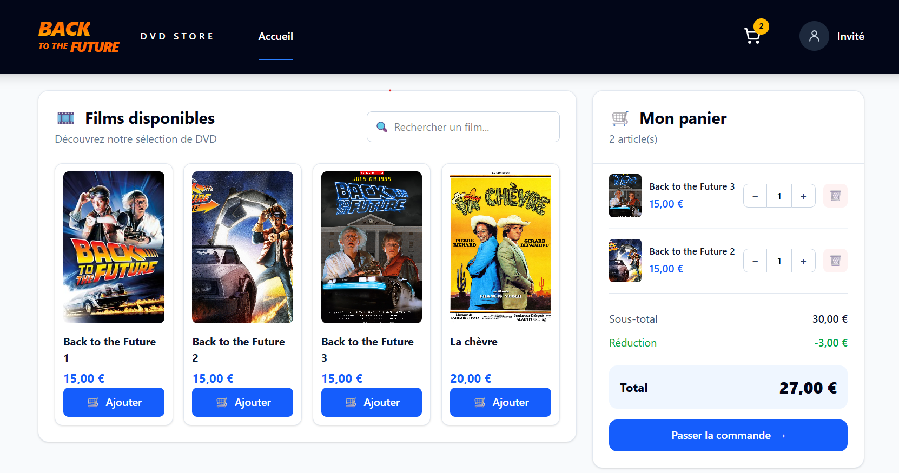
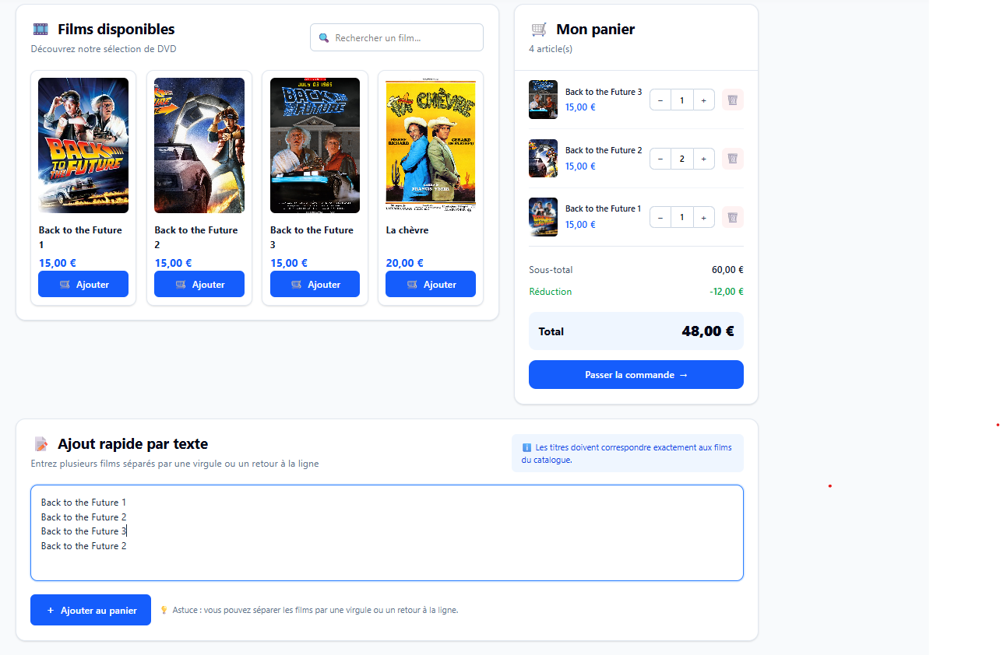
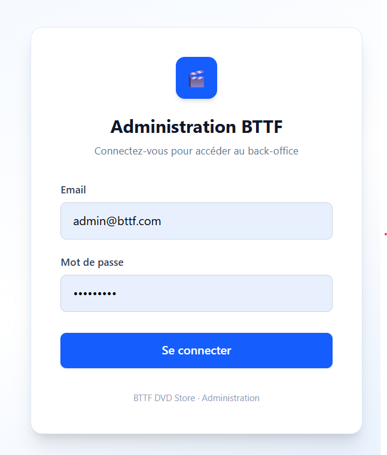
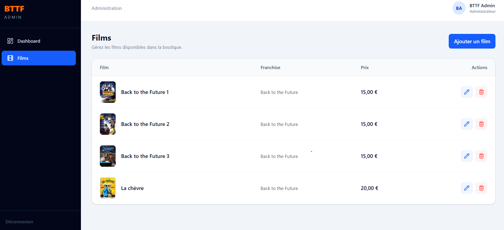

# Back to the Future - DVD Store

## Table of contents

- [Introduction](#introduction)
- [Business rules](#business-rules)
- [Demo](#demo)
- [Features](#features)
- [Technology](#technology)
- [Architecture](#architecture)
- [Configuration](#configuration)
- [Run with Docker](#run-with-docker)

## Introduction

A DVD store application allows users to browse movies, manage a guest cart and automatically calculate discounts according to specific business rules.

Users can also build their cart by entering movie titles as text.

The project includes a separate administration application for managing the movie catalog.

## Business rules

Back to the Future DVDs cost **15€** each, while other movies cost **20€**.

A discount is applied to all Back to the Future DVDs in the cart depending on the number of **different installments** purchased:

| Different BTTF installments |    Discount |
| --------------------------- | ----------: |
| 1                           | No discount |
| 2                           |         10% |
| 3                           |         20% |

### Examples

```text
BTTF 1 + BTTF 2 + BTTF 3
= 36 €

BTTF 1 + BTTF 3
= 27 €

BTTF 1
= €15

BTTF 1 + BTTF 2 + BTTF 3 + BTTF 2
= 48 €

BTTF 1 + BTTF 2 + BTTF 3 + La chèvre
= 56 €
```

These business rules are covered by automated tests in the API.

## Demo

### DVD Store

Users can browse the available movies and add them directly to their cart.



### Cart from text input

Users can also build their cart by entering movie titles as text.

The matching movies are added to the same cart and the applicable BTTF discount is calculated automatically.



### Admin authentication

The administration application is protected by JWT authentication.



### Movie management

Administrators can manage the movie catalog from a dedicated interface.



## Features

### DVD Store

Users can:

- Browse the movie catalog.
- Add movies to the cart from the catalog.
- Add multiple movies to the same cart using a text input containing movie titles.
- Update movie quantities.
- Remove movies from the cart.
- Keep a persistent guest cart.
- Automatically calculate the cart total.
- Automatically apply the BTTF discount rules.

### Administration

Administrators can:

- Log in to the administration application.
- View the movie catalog.
- Create movies.
- Edit movies.
- Delete movies.
- Upload movie posters to AWS S3.

Administrative operations are protected using JWT authentication.

## Technology

The main technologies used to build this application are:

### Frontend

- React
- TypeScript
- Vite
- Tailwind CSS
- React Router
- Axios

### Backend

- Node.js
- Express.js
- TypeScript
- Sequelize
- PostgreSQL
- Joi
- JWT
- bcrypt

### Infrastructure

- Docker
- Docker Compose
- Nginx
- AWS S3

### Code quality

- Jest
- ESLint
- Prettier

## Architecture

The project is divided into three applications:

```text
bttf-app/
├── api/                    # REST API
├── app/                    # DVD Store
├── admin/                  # Administration application
├── docs/
│   └── images/             # README screenshots
├── docker-compose.yml
└── README.md
```

For the API, I implemented an architecture based on **Clean Architecture** and **Domain-Driven Design (DDD)**.

The goal is to separate the business logic from infrastructure and framework concerns such as Express, Sequelize and PostgreSQL.

Each application has its own documentation:

- `api/README.md` - API architecture, database, endpoints and tests.
- `app/README.md` - DVD Store configuration and frontend architecture.
- `admin/README.md` - Administration application configuration and features.

## Configuration

Create the API environment file from the provided example:

```bash
cd api
cp .env.default .env
```

Then configure the required environment variables.

```env
NODE_ENV=development
PORT=4000

DB_HOST=localhost
DB_PORT=5433
DB_NAME=bttf-db
DB_USER=postgres
DB_PASSWORD=root

JWT_SECRET=your_jwt_secret

AWS_REGION=eu-west-3
AWS_ACCESS_KEY_ID=your_aws_access_key_id
AWS_SECRET_ACCESS_KEY=your_aws_secret_access_key
AWS_S3_BUCKET_NAME=your_bucket_name
```

> AWS credentials are only required to upload new movie posters from the administration application.

For more information about each application:

- API: see `api/README.md`
- DVD Store: see `app/README.md`
- Admin: see `admin/README.md`

## Run with Docker

### Requirements

- Docker
- Docker Compose

No local installation of Node.js or PostgreSQL is required when running the project with Docker.

### Start the application

From the project root:

```bash
docker compose up -d --build
```

Docker automatically:

1. Starts the PostgreSQL database.
2. Waits until PostgreSQL is ready.
3. Runs the Sequelize migrations.
4. Runs the database seeders.
5. Starts the REST API.
6. Starts the DVD Store.
7. Starts the administration application.

The applications are then available at:

| Service    | URL                     |
| ---------- | ----------------------- |
| DVD Store  | `http://localhost:5173` |
| Admin      | `http://localhost:5174` |
| API        | `http://localhost:4000` |
| PostgreSQL | `localhost:5433`        |

### Demo administrator

A demo administrator account is automatically created by the database seeder.

```text
Email: admin@bttf.com
Password: Admin123!
```

These credentials are intended for local demonstration purposes only.

The administration application is available at:

```text
http://localhost:5174
```

### Check running services

```bash
docker compose ps
```

### View logs

```bash
docker compose logs -f
```

### Stop the application

```bash
docker compose down
```

To also remove the PostgreSQL data:

```bash
docker compose down -v
```

## Author

**Sabrine Ben Sassi**
